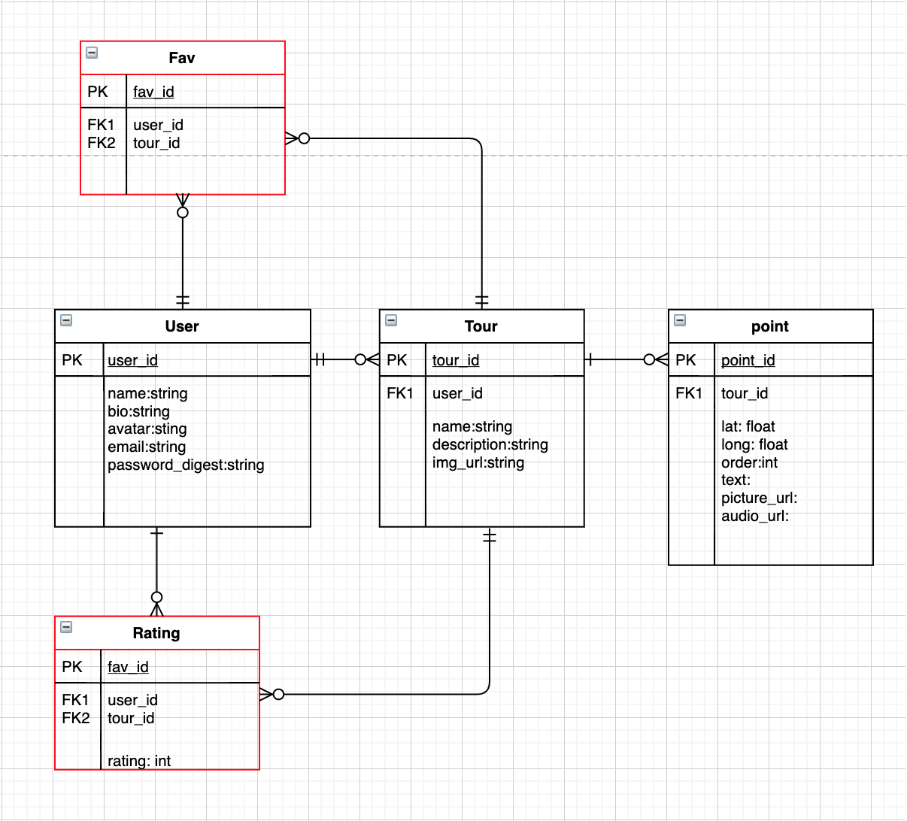

# Walking Tour App
User submitted walking tours

## Overview

_**Walking Tour App** is a full stack application for submitting and taking walking tours._

### Permissions

Digital assets used with full licensing and permission from [Unsplash](). Digital assets stored locally. PMVP includes ability to upload images.

 

## MVP

_The **Walking Tour App** MVP will allow a user to sign up/login and view and submit basic walking tours. For MVP a walking tour will consist of two or more points of interest shown on a map and some text associated with each point of interest._

 

### MVP Goals

- _User can signup and login._
- _User can submit new tours._
- _User can edit and delete their own tours._
- _User can browse existing tours._
- _User can edit their own profile._
- _User can consume tours._
- _User can place and move points on a map to indicate walking tour path._
- _User can view points on a map to indicate walking tour path._

 

### MVP Libraries

|     Library      |MVP| Description                                |
| :--------------: | :-:|:----------------------------------------- |
|      React       | Yes | _The core front end framework._ |
|      Axios       | Yes | _To make API calls from the front end to the RoR Backend._ |
|     Gatsby       | Yes | _An additional framework for the frontend focusing on fast page loads, Gatsby will handle the routing of the front end app, which is based on filestructure._ |
|  Typography.js   | No | _A CSS Addon for the frontend to make font styling easier._ |
|  TailwindCSS   | No | _A CSS Library for the frontend._ |
|   Ruby on Rails  | Yes | _The core backend framework._ |
|   Devise  | No | _Backend framework to handle security._ |
|      Rack CORS       | Yes | _Backend library to provide support for Cross-Origin Resource Sharing (CORS)._ |

 

### MVP Client (Front End)

#### Wireframes

https://scene.zeplin.io/project/5e6176ef832f4b12e2a5ce26

#### Component Hierarchy

Blue dashed components are shared and will be used in the page component placed above them in the diagram

#### Component Breakdown

|  Component   | State | Description                                                      |
| :----------: | :---: | :--------------------------------------------------------------- |
|    Login    |   n   | _Allows user to login._               |
|  Signup  |   n   | _Allows user to sign up._       |
|   LoginSignupForm    |   y   | _A shared form for login and sign up._      |
| ViewProfile |   n   | _Will render the user profile._                 |
|    EditProfile    |   n   | _Allows the initial creation and editing of a user profile._ |
|    TourlistSmall    |   n   | _Intended to show a list of tours that the user has created._ |
|    Home    |   n   | _The main page and will show a list of tours._ |
|    Tourlist    |   n   | _The component which will map over the list of all available tours._ |
|    TopNav    |   n   | _Allows some basic navigation (such as visiting user profile, home)._ |
|    BottomNav    |   n   | _More for POST MVP and would be use to filter tours._ |
|    CreateTour    |   n   | _User can create a tour._ |
|    EditTour    |   n   | _User can edit a tour._ |
|    ViewTour    |   n   | _User can view a tour._ |
|    DeleteTour    |   n   | _Confirmation page before deleting tour._ |
|    TourForm    |   n   | _Form used by create and edit tour._ |
|    TourDisplay    |   n   | _Used to display tour._ |
|    CreateMap    |   n   | _Page for editing points on a map._ |
|    EditMap    |   n   | _Page for editing points on a map._ |
|    ViewMap    |   n   | _Page for viewing a map._ |
|    Map    |   n   | _Shared component used by all the Map pages._ |
|    PointForm    |   n   | _Point edit form._ |
|    PointDisplay    |   n   | _Point display form._ |

 

### MVP Server (Back End)

#### ERD Model

Entities outlined in red intended for POST MVP

#### Endpoints

- GET `/users`
	- Index route returning an array of all Users and nested 'Tours'
- GET `/users/:id`
	- Show route for a user requested by ID
- GET `/users/:id/tours`
	- Show route for a users tours requested by ID
- GET `/users/:id/tours/:tour_id`
	- Show route for a users tour requested by ID
- POST `/users`
	- Create route for a new user
- PUT `/users/:id`
  - Update a user by id

- GET `/tours`
	- Index route returning an array of all 'Tours'
- GET `/tours/:id`
	- Show route for a tour requested by ID and nested points
- POST `/tour`
	- Create route for a new tour
- PUT `/users/:id`
  - Update a tour by id

- GET `/points/:id`
	- Show route for a point requested by ID
- POST `/points`
	- Create route for a new point
- PUT `/points/:id`
  - Update a point by id

 

***

## Planning

### Timeframes

| Task                | Priority | Estimated Time | Actual Time |
| ------------------- | :------: | :------------: | :---------: |
| Build backend   |    H     |     4 hrs      |    TBD    |
| Seed DB   |    L     |     1 hrs      |    TBD    |
| Test backend CRUD |    M     |     1 hrs      |     TBD     |
| Basic backend Auth |    M     |     5 hrs      |     TBD     |
| Build basic front end |    H     |     5 hrs      |     TBD     |
| Basic frontend Auth |    M     |     5 hrs      |     TBD     |
| Build basic front end navigation |    M     |     10 hrs      |     TBD     |
| Build front end crud |    H     |     10 hrs      |     TBD     |
| Basic front end styling |    M     |     10 hrs      |     TBD     |
| Details front end styling |    L     |     10 hrs      |     TBD     |
| TOTAL               |          |     62 hrs      |     TBD     |

 

### Schedule

|  Day   | Deliverables                              |
| ------ | ----------------------------------------- |
|Mar 4th | project proposal worksheet |
|Mar 5th | project proposal worksheet |
|Mar 6th | project proposal worksheet / project pitch / build out backend with endpoints       |
|Mar 7th | Front end components / backend and front end auth|
|Mar 8th | Front end CRUD                      |
|Mar 9th | basic styling / Continue on functionality / user flow                                   |
|Mar 10th| Continue on functionality                 |
|Mar 11th| post-MVP MVP begin styling                                  |
|Mar 12th| Styling                |
|Mar 13th| final presentations                       |

 

***

## Post-MVP

- _User can Fav and Rate tours_
- _Snap points of interest to roads/pathes_
- _Show users current location on map._
- _Give user directions how to get from one point of interest to the next._
- _Allow user to search for walking tours._
- _Show nearby walking tours._
- _Allow Show nearby walking tours._
- _Allow users to rate and favorite walking tours._
- _Allow tour creators to add audio/video to points of interest._

***

## Project Change Log

## Code Showcase

TBA

## Code Issues & Resolutions

Using Gatsby will present a challenge for my front end. I plan to not freak out and learn as I am building. I have already taken some time to investigate the framework which is helping to mitgate the risk 

***
